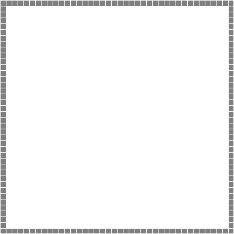

# Fluid_Simulation

## Implemented
* Staggered MAC Grid
* Different advection schemes
	* Semi Lagrangian advection with
		* Bilinear interpolation
		* Runge Kutta and Euler solver
	* PIC advection with bilinear interpolation
	* FLIP advection with bilinear interpolation
	* PIC / FLIP combination
* Pressure solve using the conjugate gradient method with the linear algebra library "Eigen"
* Enforce Dirichlet boundary condition
* Marker particles for air/fluid separation
* Velocity extension using brute force search through grid

Examples:

     

Youtube video of real time simulation:

## Not Yet Implemented
* Adaptive time steps
* Vorticity confinement
* Make sure marker particles are outside of obstacles
* Other interpolation alternatives (quadratic, cubic, Catmull Rom)
* Other air/fluid separation techniques (for example level set)
* 3D simulation
