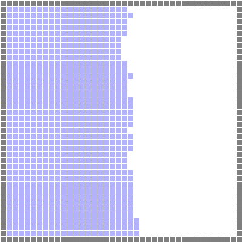

# Eulerian_Fluid_Simulation

## Implemented
* Staggered MAC Grid
* Bilinear interpolation for velocity advection
* Runge Kutta solver
* Pressure solve (using the conjugate gradient method with the linear algebra library "Eigen")
* Enforce Dirichlet boundary condition
* Marker particles for air/fluid separation
* Velocity extension

Example:

## Not Yet Implemented
* Adaptive time steps
* Vorticity confinement
* A reasonable volume preservation method
* Make sure marker particles are outside of obstacles
* Other interpolation alternatives (quadratic, cubic, Catmull Rom)
* Level set method for air/fluid separation
* 3D simulation
* Sophisticated rendering